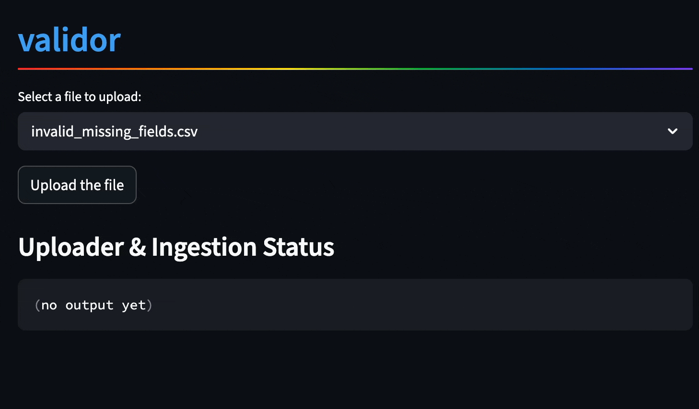
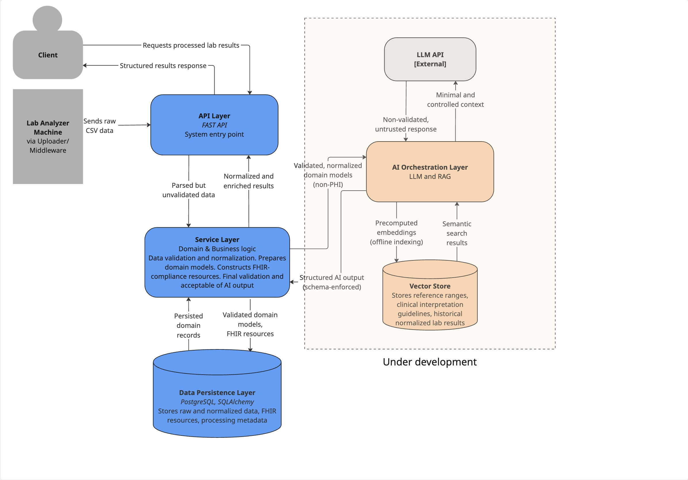
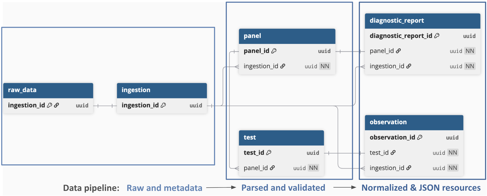
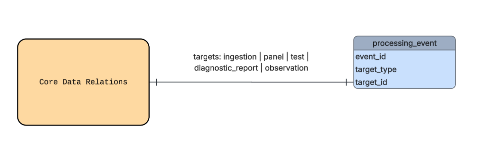
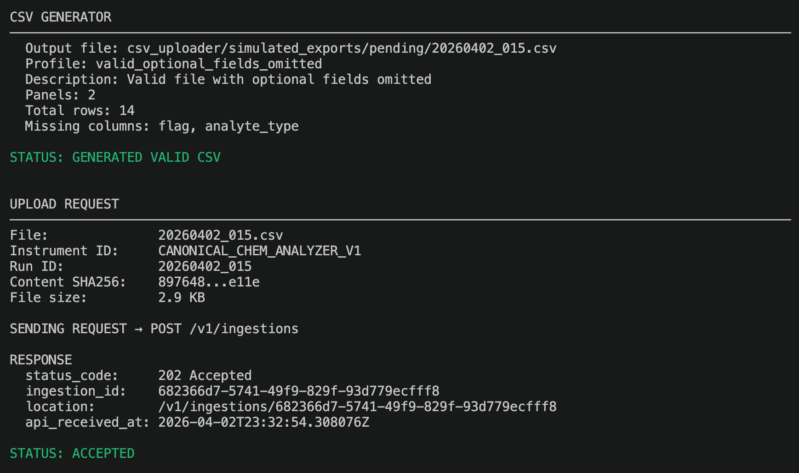
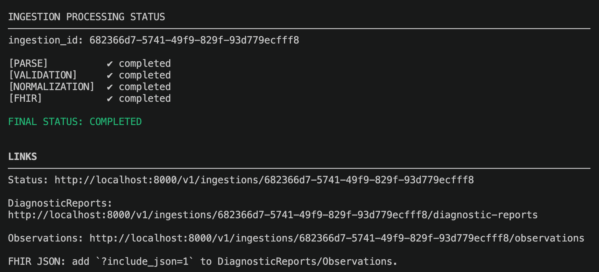
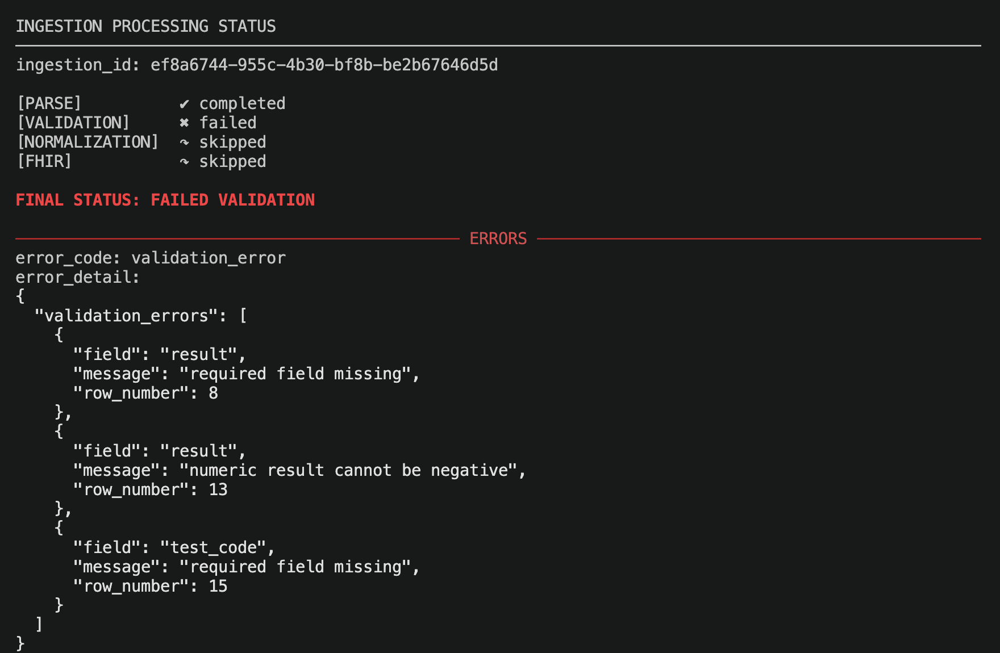

# Validor (Clinical Lab Analyzer)

Validor is a backend service that ingests lab analyzer data, validates and 
normalizes results, and persists FHIR-shaped data in PostgreSQL database with 
full auditability.

I have vast experience with a analytical lab results and know how challenging 
it is to process data, keep it complaint, and preserve auditability.
My goal is to build a service validates and normalizes lab data without adding
extra complexity.

In the next iterations, I'm planning to add AI enrichment of the findings by 
implementing controlled, non-authoritative LLM workflows.

## Demo

### Web demo: <URL>
  * Select a file from the dropdown menu. Click `Upload`
  * Ingestion status and uploading metadata will be displayed. 
  * If the data was validated and normalized without errors, use 
  `DiagnosticReports Data` and `Observation Data` buttons to show and hide 
   the data.

#### Valid file


#### Invalid file



### CLI demo:
  * Install package
  * Start docker containers
```sh
docker compose up --build
```
  * Run demo command:
```sh
uv run python run demo/cli_demo.py --once
```

  * What you see in the demo:
    * CSV generator creates a file with a randomly selected CSV profile (valid 
      or invalid).
    * Uploader sends an API request and receives the response.
    * The service validates, normalizes and persists the data. Polling status
      is shown for each stage. In case of failed validation, error details are
      displayed.


## Tech Stack

* **Backend :** Python, FastAPI, Pydantic
* **Database:** PostgreSQL, SQLAlchemy (ORM)
* **DevOps:** Docker
* **Healthcare Compliance:** FHIR (Observation and DiagnosticReport resources)
* **Testing:** Pytest
* **Environment & Dependency Management:** uv

## Scope
### In Scope

* Ingestion of canonical analyzer output
    * The system assumes a canonical analyzer output schema. 
      Instrument-specific formats would be handled via adapter layers in 
      production
    * The service models a subset of chemistry analyzer outputs
* Data ingestion format: CSV
* Two FHIR resources:
    * Observation (individual analytes)
    * DiagnosticReport (panel-level grouping)


### Out of Scope

* Processing output from a vendor-specific analyzer
* Frontend dashboards
* Real clinical workflows
* Authentication
* Real device integrations
* PHI

## Service Architecture

### High-level overview



The service has layered architecture to isolate concerns and ensure that
each layer has access only to the data appropriate to its responsibility. 

1. External data source: Lab Analyzer Simulator and uploader (middleware)
* The analyzer CSV generator and CSV uploader are intentionally kept outside 
the ingestion service. They simulate external systems in the pipeline
* Data flows into the service through a controlled API boundary. No direct
  access to database and service-layer is allowed
* The system assumes a canonical analyzer output schema. 
* CSV generator creates a file with a randomly selected CSV profile (valid 
or invalid).
* An uploader/middleware forms a request to API and sends data to the API 
  layer
      

2. API Layer: FastAPI
   * Acts a single entry point
   * Responsible for request orchestration and boundary enforcement
   * API Layer keeps track of each ingestion status
   * Any validation error persists nothing in tables containing results. Raw 
   data, metadata and processing events are persisted regardless of validation
    status.

    * API contracts:
      * [POST data to API](api_contracts/raw_csv_api_contract.md)
      * [Read data from API](api_contracts/read_api_contract.md)


3. Service Layer: Domain and Business Logic
   * Responsible for data validation, normalization, and conversion into domain
     models
   * Data pipeline: raw ingest - parsed relations - validated and normalized 
   FHIR artifacts.


4. Persistence Layer: Database
  * Stores raw and normalized data, generated FHIR resources,
     metadata, and and processing events.
  * Data pipeline:


  
  * At each stage, processing events (for example, VALIDATION_STARTED, 
   VALIDATION_SUCCEEDED, VALIDATION_FAILED) are persisted in the database to 
   ensure auditability.




### Trade-offs

#### Authentication and Trust Model
For simplicity, the CSV uploader and ingestion API are assumed to operate 
within a trusted internal network. Authentication is intentionally omitted. 
In a production setting, this boundary would be enforced via API keys, mTLS, 
or service identity.

#### FHIR Resources
We deliberately don’t use a full FHIR object library. Instead, we emit a 
strictly versioned, minimal R4-compliant projection using Pydantic so the JSON 
exactly reflects our domain semantics and remains reproducible across pipeline 
versions.


## Metrics
* Ingestion validation accuracy
* Performance optimization: Throughput increase
    * ingestions per minute
    * number of queries per data row
* Test coverage
  * Average test coverage is 94%, with median test coverage of 95%. Coverage 
    tracked for business logic and idempotent persistence paths. End-to-end 
    testing is not included in the coverage.

## Features

### FHIR Resources

The service works with 2 resources: DiagnosticReport and Observation.
DiagnosticReport resource groups Observation resources and provides clinical 
context. Observation resource contains individual test result.

### Idempotency & Data Integrity

* Idempotent ingestion enforced via `(instrument_id, run_id)` uniqueness and 
content hashing  
* Duplicate detection using SHA-256 comparison (submitted vs. server-computed)  
* Conflict protection: mismatched hashes for the same ingestion key are 
rejected


## Installation & Setup

### Prerequisites


### Quick Start

1. **Clone the repository**
```sh
git clone <INSERT URL>
cd path/to/folder
```

2. **Create environment files**
? nothing here?

4. **Build docker images and start containers**
   Starting the containers and database migration can take a few seconds.

```sh
docker compose up --build
```

5. **Run the application**
   
   In a different terminal,

  * To generate a CSV and upload it in one command:
      ```sh
      uv run python run demo/cli_demo.py --once
      ```
  * To run the CSV generator and uploader separately:
    
    * Run CSV generator. By default it saves the CSV in a folder 
      `csv_uploader/simulated_exports/pending`:
      ```sh
      uv run python run csv_uploader/csv_generator.py
      ```

    * Run CSV uploader. By default it processes all CSV files from 
      `csv_uploader/simulated_exports/pending` directory and moves them to 
      `csv_uploader/simulated_exports/uploaded` in case of successful API 
      request (code 200 or 202) or to `csv_uploader/simulated_exports/failed`
      if API response indicated error (e.g. 409).

      ```sh
      uv run python run csv_uploader/csv_uploader.py
      ```

## Stopping the Application
```sh
docker compose down
```
## Application Screenshots 

* A valid CSV file is generated and uploaded 


* Data is successfully validated and normalized


* Failed validation. Error details are included for each data row to ensure
traceability.

 


## Development Roadmap

* Add an AI enrichment of findings, such as reference ranges, historical context,
  and clinical guidelines used as a controlled augmentation layer (RAG, schema 
  verification, acceptance process, provenance)
* Replace in-process FastAPI background tasks with more durable workers for 
  enhanced reliability and further throughput increase 

## License
MIT


## Version History

* **0.0.1** Pre-release

**Last Updated:** April 2026


