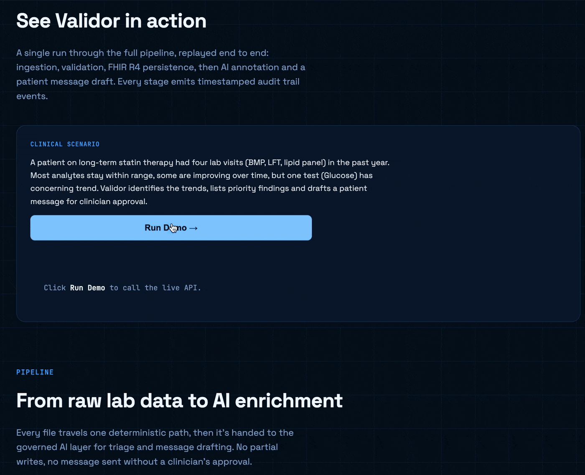
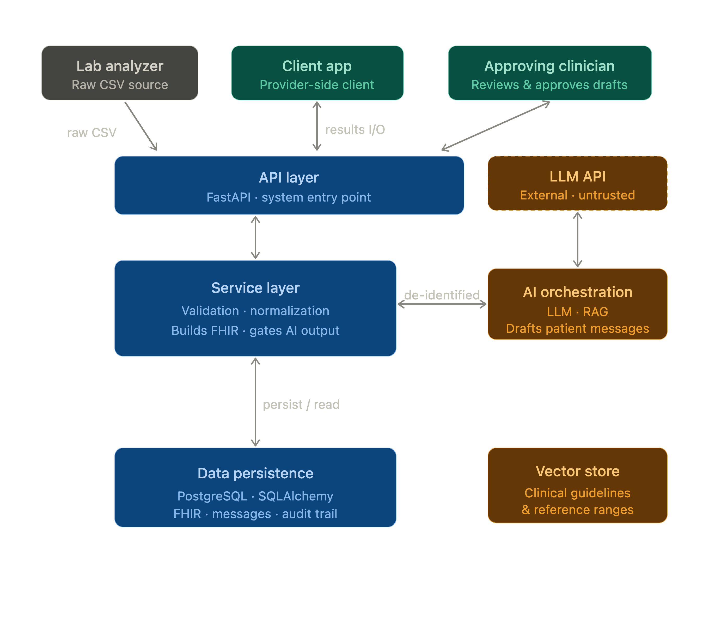
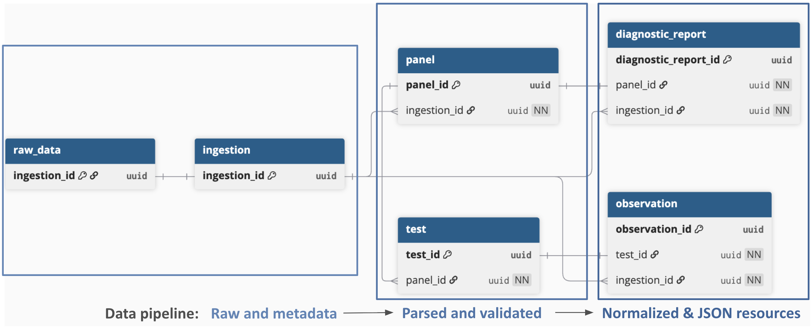
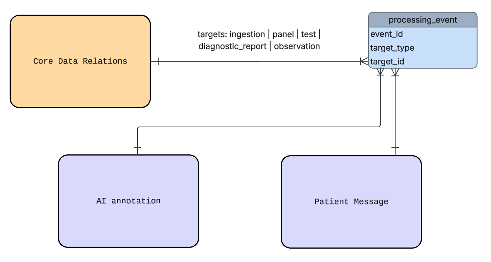
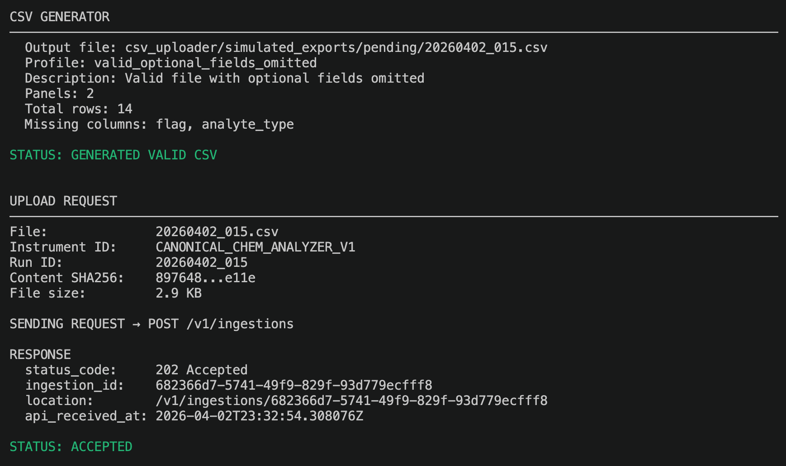
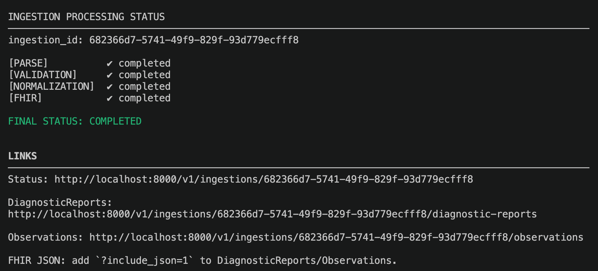
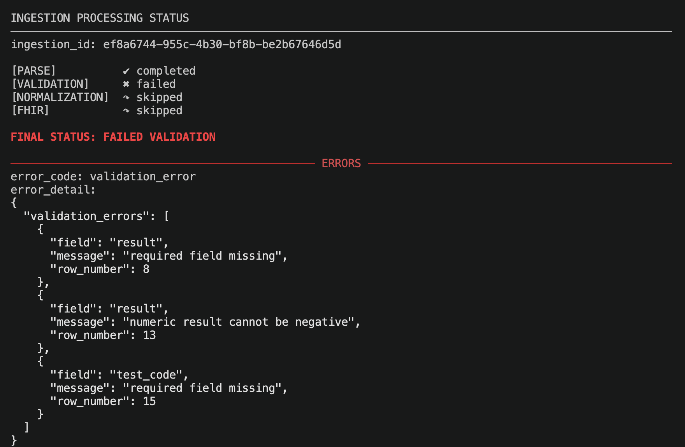

# Validor (Clinical Lab Analyzer)

Validor is a health tech service that ingests lab results reports and persists 
validated/normalized data as FHIR resources. A governed AI layer then produces a
triage-like summary (priority of findings, concerning/improving trends) and a 
patient message for clinician's review. 

Validor is built to assist clinicians, so they can focus on high priority results,
easily see patients' lab trends, and effectively communicate them to their patients. 

Lab data processing is reliable and traceable through deterministic 
validation, standardized normalization, idempotent ingestion, and explicit 
provenance tracking.

Governed AI layer. AI runs only on successfully normalized data and augments it, 
never gates or alters it. No direct identifiers cross into the AI layer. AI's 
contribution is grounded in clinical guidelines (RAG) and de-identified lab 
results history. It's fully traceable and schema verified. The AI outputs must 
be reviewed and approved by clinician.

For the demo, 3 test panels and corresponding clinical guidelines were included
(Basic Metabolic Panel, Lipid, and Liver Function Tests).

## Demo

### Live Demo: [link](https://getvalidor.com/) 
* Dockerized app (hosted on AWS EC2 instance) with live API.
* See service in action: from raw lab report ingestion through the pipeline.




### Local Demo: Docker & CLI
See [Installation & Setup](#installation--setup) for the quickest local run.


## Tech Stack

* **AI Orchestration:** AWS Bedrock, LangChain, LangSmith (tracing), RAG, pgvector 
semantic retrieval, OpenAI embeddings (`text-embedding-3-small`)
* **Backend:** Python, FastAPI, Pydantic
* **Database:** PostgreSQL (pgvector), SQLAlchemy (ORM), Alembic (migrations)
* **DevOps:** AWS EC2, Docker, Docker Compose, Nginx, CI Testing (GitHub Actions)
* **Healthcare Interoperability:** FHIR R4 (Observation and DiagnosticReport resources)
* **Testing:** Pytest
* **Environment & Dependency Management:** uv
* **Demo:** Next.js (web UI)


## Service Architecture

### Overview



Validor has a layered architecture to isolate concerns, enforce strict data
boundaries, and ensure auditability across the pipeline. 

---

### External Source: Lab Analyzer Simulator and Data Uploader
* Intentionally external to model real-world system boundaries
* Simulates a canonical lab analyzer output via controlled CSV generation
* Sends data only through the API (no direct database or service access)
      

### API Layer: FastAPI
* Single entry point with strict boundary enforcement
* Orchestrates the ingestion lifecycle and status tracking
* Ensures atomicity
  * Request level: malformed POST requests or failed pre-ingestion checks (e.g.,
  hash mismatch) are rejected, and data is prevented from reaching 
  validated/normalized layers
  * Pipeline level: invalid data is rejected before reaching downstream tables.
  No partial writes to validated and normalized data tables
  * Raw data, metadata, and processing events are always persisted for
  auditability

* **API contracts**
  * [POST data to API](api_contracts/raw_csv_api_contract.md)
  * [Read (GET) data from API](api_contracts/read_api_contract.md)


### Service Layer: Domain and Business Logic
* Implements validation, normalization, transformation, AI augmentation workflows
* Data pipeline: raw ingest -> parsed relations -> validated and normalized 
FHIR artifacts -> AI Annotation -> Patient Message


### Persistence Layer: PostgreSQL


* Stores:
  * Raw data and ingestion metadata
  * Validated and normalized data
  * FHIR resource projections (JSONB)
  * AI annotations with metadata
  * Patient message with human and machine gates
  * Processing events (provenance log). Ensures full auditability via append-only
processing events at each stage (for example, VALIDATION_STARTED, 
VALIDATION_SUCCEEDED, VALIDATION_FAILED)




### AI Layer: Governed LLM Augmentation
The AI layer runs after the deterministic pipeline and only on successfully
normalized data. 

Two controlled LLM flows run in sequence, sharing the same de-identified
boundary and RAG plumbing. The second is gated on the first: message drafting
starts only when normalization succeeded and AI enrichment succeeded.
* **AI enrichment (triage annotation)** produces a structured summary: priority
of findings, concerning/improving trends, and a review priority.
* **Patient-message draft** produces a plain-language message for the patient,
drafted for clinician review.

#### De-identified AI boundary
* No direct identifiers cross into the AI layer. It's done via pseudonymization,
not full de-identification. Hardening this seam is on the roadmap.

#### Grounded and traceable
* **RAG:** abnormal findings drive a semantic search over clinical guideline
embeddings, grounding output in retrieved context.
* **History-aware:** prior results for the same analytes are included so the
model can reason about trends.
* **Schema-verified:** every LLM response is validated against a versioned
Pydantic content schema.
* **Provenance:** configuration, prompt, schema versions, and an 
input hash are recorded per generation, alongside append-only processing events.

#### Two-gate governance
* **Machine gate**: the drafted message must pass schema validation before it 
can reach a clinician.
* **Human gate**: a clinician must review each draft, edit, approve and send, 
or reject.
* **Demo-send only:** "send" flips APPROVED → SENT and records an audit event.
 

### Trade-offs

#### Trust Boundary
* Authentication between canonical lab analyzer and service is omitted 
(assumed trusted internal network)
* Production design would be enforce API keys, mTLS, or service identity

#### FHIR Modeling
* Uses versioned, minimal R4-compliant projections via Pydantic

## Metrics (Deterministic Pipeline)
**Validation accuracy**
* File-level: 30/30 files correctly classified (24 invalid, 6 valid)
* Row-level: precision 100.0%, recall 99.5% across 49,896 rows


**Performance optimization**
* Query efficiency: query count per row reduced by 92% median to median 0.69 
queries per row (N+1 eliminated, batching applied)
* Database time: median database time per ingestion reduced by 80% 
* Throughput: 3.8-fold increase (from 88.6 files/min to 333.8 files/min)


**Test coverage (Deterministic Pipeline)**
* 94% average, 95% median (business logic and repository layers, focus on 
idempotent persistence paths)
* Excludes end-to-end testing


## Data Integrity & Idempotency (Deterministic Pipeline)

* Idempotent ingestion enforced via `(instrument_id, run_id)` uniqueness
* Content-based deduplication using sha-256 (submitted vs. server-computed)  
* Conflict detection: mismatched hashes for the same ingestion key are 
rejected
* Deterministic outcomes: deduplicate identical, conflict, or new ingestion
* No silent overwrites or partial normalization writes


## Installation & Setup

### Prerequisites

* **python**: version >=3.13 
* **Docker Desktop**: latest
* **uv**: package manager, latest

### Quick Start

1. **Clone the repository**
    ```sh
    git clone https://github.com/masyago/validor
    cd validor
    ```

2. **Create and activate virtual environment**
    ```sh
    # Windows
    python -m venv .venv
    .venv\Scripts\activate

    # macOS/Linus
    python3 -m venv .venv
    source .venv/bin/activate
    ```

3. **Configure environment variables**

    Copy the example file and fill in the values you need:
    ```sh
    cp .env.example .env
    ```
    `.env` is gitignored — never commit real secrets. See `.env.example` for the
    full, documented list. Summary:

    | Variable | Needed for | Notes |
    | --- | --- | --- |
    | `API_PORT` | Local API host port | Defaults to `5001`; must match the `localhost:<port>` data links below. |
    | `OPENAI_API_KEY` | AI enrichment (embeddings) | Used for semantic guideline retrieval. |
    | `BEDROCK_MODEL_ID`, `AWS_REGION` | AI enrichment / patient message | LLM provider; AWS credentials come from the standard boto3 chain (mounted `~/.aws`). |
    | `LANGSMITH_*` | Tracing (optional) | Leave unset to disable. |
    | `RESEND_API_KEY`, `CONTACT_EMAIL` | Contact form (site footer) | Only needed if running the web contact form. |

    The **deterministic pipeline** (ingest → validate → normalize) runs without any
    API keys. The **AI layer** requires the embedding + Bedrock variables above.

4. **Build docker images and start containers**
It can take a few seconds.

    ```sh
    docker compose up --build
    ```
    
5. **Run the CLI demo**

    In a **different** terminal:
    ```sh
    cd validor
    ```
    Then create and activate virtual environment.

  * To generate a CSV with lab results and upload it in one command:
    ```sh
    uv run python demo/cli_demo.py --once
    ```
    Terminal output provides details on generated CSV file, its upload and
    processing status, and links to data.

    Generated CSV can be valid or invalid. Valid files are processed through 
    the pipeline end-to-end while invalid ones fail during the deterministic 
    phase. They are not persisted as FHIR resources and not sent for AI 
    enrichment.


    * Links with the data:

      Copy `ingestion_id` from API response.

      - Status: http://localhost:5001/v1/ingestions/<ingestion_id>

      View data in web browser. Note that the data persisted only for valid
      ingestions. 
      - DiagnosticReports: http://localhost:5001/v1/ingestions/<ingestion_id>/diagnostic-reports
      - Observations: http://localhost:5001/v1/ingestions/<ingestion_id>/observations
      - FHIR JSON: add `?include_json=1` to DiagnosticReports/Observations.
      - AI annotations: http://localhost:5001/v1/ingestions/<ingestion_id>/ai_annotation
      - Patient message: http://localhost:5001/v1/ingestions/<ingestion_id>/patient_message


6. **Stop the application**

    In the first terminal:
      * Windows, `Ctrl+C`
      * macOS/Linus, `Command+C`
    

## Screenshots 


*A valid CSV file is generated and uploaded*

  

---

*Data is successfully validated and normalized*

  

---

*Failed validation. Error details are included for each data row to ensure
traceability*

  

---


## Development Roadmap

* Replace in-process FastAPI background tasks with more durable workers for 
  enhanced reliability and further throughput increase 
* Harden the de-identification boundary: swap the `ai_generation_job` correlation
  table for Redis + TTL and move AI drafting to an async worker (the 
  `correlation_id` round-trip is the seam)

## License
MIT


## Version History

### 2.0.1 (2026-07-14)
* Governed AI layer. Added AI annotations (triage: priority findings, trends)
and patient message (requires clinician approval before sending)

### 1.0.2 (2026-05-13)
* Demo deployment on AWS EC2
* New improved demo UI

### 1.0.1 (2026-04-13)
* Demo deployment on Render
* CI testing on pull requests

### 1.0.0 (2026-04-10)
* Initial stable release

### **0.0.1** Pre-release

**Last Updated:** July 2026


