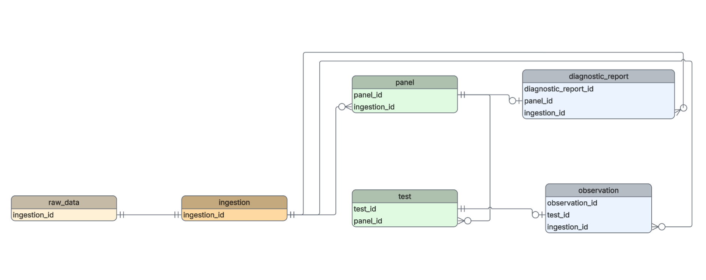
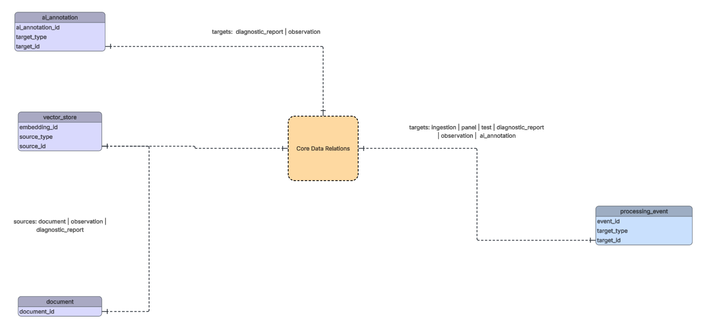

# Database Design 

## Tables 
Models defined in SQLAlchemy, used a migration tool Alembic to create the relations
in Postgresql.
 
### ERD

#### Core Data Pipeline
Demonstrates data flow from a clinical lab analyzer to normalized results.

#### AI and Provenance
Shows tables and relationships related to AI and provenance.

Polymorphic associations (processing_event, ai_annotation, vector_store) are 
intentionally represented as (type, id) pairs and omitted from the core ERD for
clarity.

### Immutable (source of truth)

* `ingestion`
* `raw_data`
    * one-to-one relationship with `ingestion` on key `ingestion.ingestion_id`.
     Both sides are mandatory

### Staged Data

Parsed, not normalized

* `panel`
    * one-to-many relationship with `ingestion` on key `ingestion.ingestion_id` ("one" side)
* `test`
    * one-to-many relationship with `panel` on key `panel.panel_id` ("one" side)

### Normalized Data

FHIR-like normalized and validated data

* `diagnostic_report`
* `observation`

### AI Augmentation

* `ai_annotation`
* `vector_store`
* `document`

### Processing Log 

Append-only operational history
* `processing_event`

## version 0