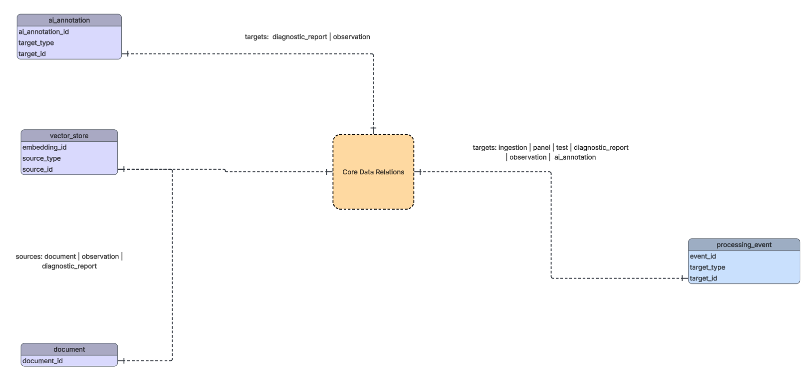

# Database Design 

## Tables 
Models defined in SQLAlchemy, used a migration tool Alembic to create the relations
in Postgresql.
 
### ERD

#### Core Data Pipeline
Demonstrates data flow from a clinical lab analyzer to normalized results.

#### AI and Provenance
Shows tables and relationships related to AI and provenance.

Polymorphic associations (processing_event, ai_annotation, vector_store) are intentionally represented as (type, id) pairs and omitted from the core ERD for
clarity.

### Immutable (source of truth)

* `ingestion`
   
* `raw_data`
    * one-to-one relationship with `ingestion` on key `ingestion.ingestion_id`.
     Both sides are mandatory
    

### Staged Data

Parsed, not normalized

* `panel`
    * one-to-many relationship with `ingestion` on key `ingestion.ingestion_id` ("one" side)
* `test`
    * one-to-many relationship with `panel` on key `panel.panel_id` ("one" side)

### Normalized Data

FHIR-like normalized and validated data

* `diagnostic_report`
* `observation`
 Normalization. Normalization is a deterministic, idempotent transformation from validated canonical domain records into FHIR-shaped entities, adding transform/version metadata and enforcing representation-level invariants; it does not re-validate raw ingestion, but it does validate the produced normalized artifact (and any serialized FHIR JSON) and records provenance via processing events.

 Status: "FINAL". Only one status. Because a normalized artifact is only meaningful if it’s complete and internally consistent. Failure is a pipeline concern, not a persisted clinical artifact.
 
### AI Augmentation

* `ai_annotation`
    * one-to-many with `ingestion` on key `ingestion.ingestion_id`. A row is
      either an accepted annotation (`content_json` matches the internal schema)
      or a rejected-annotation audit payload.
    * `correlation_id` (nullable) records the job-scoped de-identification token
      minted for the enrichment call (see `ai_generation_job`).
* `vector_store`
* `document`

### Patient & Patient Message

Demo-stage tables supporting the clinician-gated patient-message drafting flow.

* `patient`
    * `patient_id` TEXT **PK** — the natural key already carried on
      `panel`/`diagnostic_report`/`observation`, which now FK back here.
    * Minimal synthetic demographics only: `given_name`, `family_name`, `email`
      (all render-only), plus `is_synthetic` BOOLEAN (default TRUE) marking that
      the row holds no real PHI. Deliberately excludes
      age/gender/birth_date/address/phone/consent.
    * Rows are upserted deterministically from `patient_id` at ingestion time (no
      CSV/parser contract change).
    * `panel.patient_id`, `diagnostic_report.patient_id`, and
      `observation.patient_id` are FKs → `patient.patient_id`.

* `patient_message`
    * one plain-language message covering a **whole ingestion** (a patient's
      result set for that run). FK → `ingestion.ingestion_id` and
      → `patient.patient_id`.
    * `draft_content_json` JSONB — immutable, schema-enforced LLM output (no PHI;
      name/email applied only at render time). `final_content_json` JSONB holds
      the clinician-approved/edited content.
    * Provenance columns mirror `ai_annotation` (`provider`, `model_id`,
      `prompt_version`, `temperature` (TEXT), `input_hash`,
      `content_schema_version`, `created_at`) plus `correlation_id` and
      `generation_event_id` FK → `processing_event.event_id`, and
      `retrieved_refs_json` JSONB.
    * **Two status columns, on purpose:**
        * `validation_status` (`PENDING | ACCEPTED | REJECTED`) — machine gate:
          the service accepts the schema-valid LLM output.
        * `review_status` (`DRAFT | PENDING_REVIEW | APPROVED |
          CHANGES_REQUESTED | REJECTED | SENT | SUPERSEDED`) — human clinical
          sign-off. A draft cannot leave `DRAFT` for `PENDING_REVIEW` unless
          `validation_status = ACCEPTED` (enforced in the service layer).
    * Constraints: partial unique index — at most one **active** message per
      ingestion (`review_status NOT IN ('SUPERSEDED','REJECTED')`); check —
      `final_content_json` only when `review_status IN ('APPROVED','SENT')`;
      check — no self-supersede.

* `ai_generation_job`
    * Trusted-side correlation map implementing the de-identification boundary,
      **shared by both AI flows** (enrichment and patient-message drafting).
    * `correlation_id` UUID **PK** — a random, job-scoped token (NOT derived from
      `patient_id`). `job_type` (`ENRICHMENT | PATIENT_MESSAGE`) discriminates.
      FKs → `patient.patient_id` and `ingestion.ingestion_id`; `consumed_at`
      enforces one-time use (consume-on-resolve).
    * The service mints the token trusted-side, passes only the `correlation_id`
      (plus a de-identified clinical payload) across to the AI layer, then looks
      up the token here to recover `patient_id` — it never "decodes" the token.
      `patient_id`/PHI never crosses to the AI layer. (Prod option: Redis + TTL.)

### Processing Log 

Append-only operational history
* `processing_event`
    * Patient-message stage events: `MESSAGE_DRAFT_STARTED`,
      `MESSAGE_DRAFT_SKIPPED`, `MESSAGE_DRAFT_SUCCEEDED`, `MESSAGE_DRAFT_FAILED`,
      and `MESSAGE_SENT` (demo-send audit), attributed to the `MESSAGE_DRAFTER`
      actor and (for `MESSAGE_SENT`) targeting the `PATIENT_MESSAGE` row.

## version 0